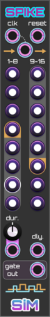
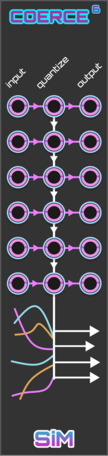

# SIM plugin

### SIM Expandables and Expanders principles

- An Expandable can have input Expanders to its left and output Expanders to its right.
- An Expander is connected when it is directly next to a compatible Expandable on the correct side given the type of the Expander, or when it is next to a connected Expander that is directly or indirectly connected to a compatible Expandable on the correct side.
- A consecutive sequence of connected input Expanders, an Expandable and output Expanders is called a chain.
- Each Expander can be used only once in a chain.
- Expandables have internal data buffers which come in two types: Voltages and Gates. (floats and booleans).
- Expanders transform the data buffer in an Expandable. The transformation on Voltages may differ from the transformation on Gates.
- The transformations of input Expanders are cumulative. They sequentially transform the buffer.
- The transformations of output Expanders are not cumulative. (there is only one transforming output expander as of this writing)
- Buffer updates take place when:
  - a module is added or removed from the chain
  - an input value in chain has changed
  - a parameter in the chain has changed
  - an output port in the chain is connected or disconnected
  - a setting in the chain has changed

The Image below illustrates the conceptual flow of data and transformations.

# Expandables

## Via

**Compatible Expanders:** Rex, Inx, Outx

**Buffer type:** Voltage

**IN:**
The Values of the channels at the input represent the original value buffer.

**OUT:**
The output channels at OUT are the values after all transformations have taken place.

*NOTE: If not otherwise specified, CV values are expected to be in the range 0 to 10 V.*

## Arr

**Compatible Expanders:** Rex, Inx, Outx

**Buffer type:** Voltage

The original value buffer are the knob values.

**OUT:**
The output channels at OUT are the values after all transformations have taken place. All outputs (including values from input Expanders) will be quantized according to the selected Snap to setting (see below). 

**Menu Settings**

- **Voltage Range:**
Sets the minimum and maximum values of the knobs
- **Snap to:**
  - None: No snapping
  - Octave: Snap to rounded voltages (-1V, 0V, 5V, etc.)
  - Fraction: Snap to the selected numerator / denominator.
  - Steps: Snap to multiples of 10 / 16 V (Values can be edited and will be displayed using integers. Inputting 5 will output 5**10/16 V. Hover over a value of 5 steps will display #5 instead of 3.125V)
- Scales: Snap to the selected scale (Notes can be edited using note names and their octaves (Cb4, F#-1) and will be displayed using note correct names on hover)
- **Root note:** Sets the root note of the selected scale.

## Bank

**Compatible Expanders:** Rex, Inx, Outx

**Buffer type:** Gates

The original value buffer consists of the states of the light switches

**OUT:**
The output channels at OUT are the values after all transformations have taken place. 

**Menu Settings**

- **Voltage Range:** Sets the maximum values of the buttons

## Phi

**Compatible Expanders:** Rex, Modx, Inx, Gaitx

**Buffer type:** Voltages

The original value buffer are the channels at **poly in**

Phi works with a play head reading values from the original buffer.

**clk:** Dictates the speed of the play head. Without **next** connected, the play head moves at the speed of the clock. Phi always needs a clock. Even when **next** is connected.

**next**: A trigger at **next** will jump the play head to the start of the next step in the buffer and then continue moving. If no trigger is received before the end of this step is reached, the play head comes to a halt right before the next value in the buffer.

**reset:** Resets the play head to its initial position.

**Step Trigger**: This output will be high whenever the play head enters a new step. The duration (relative to the clock period) can be set using the context menu.

**OUT:** The value at out is simply the value under the play head after transformations by expanders.

**Menu Settings**

- **Remember speed after reset:** Enabling this allows for a smooth start. The speed of the play head is known immediately instead after two clock pulses.
- **Gate length:** Sets the gate length relative to the clock period.

## Spike

**Compatible Expanders:** Rex, Modx, Inx, Outx, Gaitx

Spike works with a play head reading values from the original buffer.

**Buffer type:** Gates

The original value buffer consists of the states of the light switches

**clk:** Dictates the speed of the play head. Without **next** connected, the play head moves at the speed of the clock. Spike always needs a clock. Even when **next** is connected.

**next**: A trigger at **next** will jump the play head to the start of the next step in the buffer and then continue moving. If no trigger is received before the end of this step is reached, the play head comes to a halt right before the next value in the buffer.

**reset:** Resets the play head to its initial position.

**dur.:** Using the duration knob you can set the duration of all gates. Connecting a cable to the **dur. cv input** turns the **dur.** knob into an attenuverter. A monophonic input sets the gate duration for all gates, whereas a polyphonic input will set the gate duration per step. The CV input expects values in the range 0 to 10 V where 10V equals a 100% step length and 1V ten percent step length. 

**dly.:** The polyphonic CV delay input sets the gate delay per step. The CV input expects values in the range 0 to 10 V, where 10V equals a 100% step length and 1V ten percent step length. 

**gate out:** Monophonic output. It is high when transformations have taken place and the play head detects reads a high gate.

# Expanders
## Rex

**Type:** Input Expander

Adjusts the start and length of the buffer. When the length exceeds the maximum number of channels (16), it will wrap to 0 and continue. If the length exceeds the length of the input buffer, it will wrap around that length and repeat its values.

The start and length button do not operate as attenuverters when using their CV inputs. The CV inputs are polyphonic.

## Inx

**Type:** Input Expander

Voltages at the input ports overwrite, are inserted, or summed with the original corresponding buffer values depending on the selected mode

**Modes:** 
- Overwrite: Overwrites buffer values with the value of the first channel of the corresponding input port.
- Insert: Inserts all the channels of the corresponding input port into the buffer, with a total maximum of 16 channels. The first port inserts before the first original buffer. The second port after the first original channel and before the second., etc.
- Add / AND: When applied to a Voltage buffer, the input values will be added (summed), with the original buffer values. When applied to a Gate buffer, resulting value will be a logical AND of the original and the input value.

## Outx

**Type:** Output Expander

**Normalled Mode:**
- Off: All outputs will be copied or cut individually.
- On: All outputs will be copied or cut as a range.

**Cut Mode:**
- Copy: Values will be copied from the buffer to the corresponding output port.
- Cut: Values will be cut from the Expandable buffer in the case of a Voltage buffer. In the case of a Gate buffer, 'high' values will be converted to 'low' values.

When used in combination with spike, the corresponding output port will only be high if the Spike play head passes the gate.

### Sequencer expanders

## Gaitx

Gaitx is an output expander for SIM sequencers.

**EOC:** High when the connected sequencer passes through the begin/end of a buffer.

**Step phase:** Outputs the phase per step of the connected sequencer.

**Current step:** Outputs a voltage proportional to the step position in the buffer of the connected sequencer. The voltage per step can be set using the context menu.

## Modx

Modx is an input expander for SIM sequencers.

**rnd.:** Polyphonic input to control randomness per step.
- In combination with [Phi](#phi) it increases the chance for the current step to be a randomly picked from the value buffer after transformations.
- With [Spike ](#spike) it increases the chance of a gate that was high to be low.

**reps.:** Sets the number of repetitions per step. (one step is 10/16 V, using [Arr](#arr) can make dialing in the number of steps easier).
- In combination with [Phi](#phi) it will output more triggers on its **Step trigger** output.
- In combination with [Spike](#spike) a full gate duration will be divided by the number of steps and outputted on its main output.

**dur.:** The duration of the repetition steps.

**glide** Sets the glide value per step of a sequencer.
- In combination with [Phi](#phi) it will glide from the current value at to the value of the current step. The controls **dur.** and **shape** control the relative duration and exp/linear/log shape of the glide.
- In combination with [Spike](#spike) it will force the gate duration to 100% ignoring settings like gate duration, gate delay or transformations. This is useful when using Phi and Spike to form a sequence.

# Other modules

## Tie

Tie is a simple polyphonic legato plugin.

## Coerce

Coerce quantizes a polyphonic signal to the values of another polyphonic signal.

**in**: The voltages of the polyphonic input at *in* in will be quantized.

**quantize**:  (quant.) The voltages of the polyphonic input at *quant.* will be used as quantization values. 

**out**: Outputs the quantized voltages using. The number of channels at **out** is the same as the number of input channels at **in**. The order of the channels is left unchanged. 

**Operation mode**: The menu allows you to choose between two operation modes. The default is *Octave fold*. In this musical mode you can imagine the quantization values of *quant.* being copied to all octaves before the input is quantized. In the second mode, *Restrict*, each input value is quantized against the voltages coming in at *quant.* without any regard for octaves.

**Rounding method**: The menu allows you to choose between three rounding methods for quantization: *Up*, *Closest*, and *Down*.

*Tip:* To use Coerce musically you could feed it quantization values from modules that output a chord or a scale like [Chords](https://library.vcvrack.com/dbRackSequencer/Chords), [ChordCV](https://library.vcvrack.com/AaronStatic/ChordCV).
Unlike traditional quantizers where the input is quantized to certain scales, Coerce can use an array of arbitrary values. On top of that the voltages can vary over time. As quantization takes place at audio rates, Coerce can be used as an audio effect as well. 

## Coerce⁶

Coerce6 is six versions of Coerce in one module. One on each row.
The quantize inputs (the middle column) are normalled down the middle column allowing.
