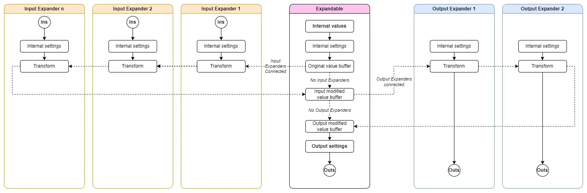

# SIM plugin

### SIM Expandables and Expanders

- An Expandable can be have input Expanders to its left and output Expanders to its right.
- Each Expander can be used only once.
- An Expander is connected when it is directly next to a compatible Expandable on the right side given the type of the Expander, or when it is next to a connected Expander that is directly or indirectly connected to a compatible Expandable on the correct side.
- A consecutive sequence of connected input Expanders, an Expandable and output Expanders is called a chain.
- Expandables have internal data buffers which come in two types: Voltages and Gates. (floats and bools).
- Expanders transform the data buffer in an Expandable. The transformation on Voltages may differ from the transformation on Gates.
- The transformations of input Expanders are cumulative. They sequentially transform the buffer.
- The transformations of output Expanders are not cumulative. (there is only one transforming output expander as of this writing)
- Buffer updates take place when:
  - there is a change in the chain.
  - an input value in chain has changed
  - a Parameter in the chain has changed
  - an output port in the chain is connected or disconnected.
  - a setting in the chain has changed.

The Image below illustrates the conceptual flow of data and transformations.

Given the design, when input values of input expanders continuously change, the number of copy operations performed will rise in proportion to the number of input Expanders. This is because not all transformations operate in place and because values are not evaluated lazily.

# Expandables

## Via

*Compatible with:* Reˣ, Inˣ, Outˣ

*Buffer type:* Voltage

*IN:*
The Values of the channels at the input represent the original value buffer.

*OUT:*
The output channels at OUT are the values after all transformations have taken place.

### Arr

*Compatible with:* Reˣ, Inˣ, Outˣ

*Buffer type:* Voltage

The original value buffer are the knob values.

*OUT:*
The output channels at OUT are the values after all transformations have taken place. All outputs (including values from input Expanders) will be quantized according to the selected Snap to setting (see below). 

*Menu Settings*

- *Voltage Range:*
Sets the minimum and maximum values of the knobs
- *Snap to:*
  - None: No snapping
  - Octave: Snap to rounded voltages (-1V, 0V, 5V, etc.)
  - Fraction: Snap to the selected numerator / denominator.
  - Steps: Snap to multiples of 10 / 16 V (Values can be edited and will be displayed using integers. Inputting 5 will output 5*10/16 V. Hover over a value of 5 steps will display #5 instead of 3.125V)
- Scales: Snap to the selected scale (Notes can be edited using note names and their octaves (Cb4, F#-1) and will be displayed using note correct names on hover)
- *Root note:* Sets the root note of the selected scale.

### Bank

*Compatible with:* Reˣ, Inˣ, Outˣ

*Buffer type:* Gates

The original value buffer are the states of the light switches

*OUT:*
The output channels at OUT are the values after all transformations have taken place. 

*Menu Settings*

* *Voltage Range:*
Sets the maximum values of the buttons

# Expanders
## Reˣ

*Type:* Input Expander

Adjusts the start and length of the buffer. When the length exceeds the maximum number of channels (16), it will wrap to 0 and continue. If the length exceeds the length of the input buffer, it will wrap around that length and repeat its values.

The start and length button do not operate as attenuverters when using their CV inputs. The CV inputs are polyphonic.

## Inˣ

*Type:* Input Expander

Voltages at the input ports overwrite, are inserted, or summed with the original corresponding buffer values depending on the selected mode

*Modes:* 
* Overwrite: Overwrites buffer values with the value of the first channel of the corresponding input port.
* Insert: Inserts all the channels of the corresponding input port into the buffer, with a total maximum of 16 channels. The first port inserts before the first original buffer. The second port after the first original channel and before the second., etc.

* Add / AND: When applied to a Voltage buffer, the input values will be added (summed), with the original buffer values. When applied to a Gate buffer, resulting value will be a logical AND of the original and the input value.

### Outˣ

*Type:* Output Expander

*Normalled Mode:*
* Off: All outputs will be copied or cut individually.
* On: All outputs will be copied or cut as a range.
*Cut Mode:*
* Copy: Values will be copied from the buffer to the corresponding output port.
* Cut: Values will be cut from the Expandable buffer in the case of a Voltage buffer. In the case of a Gate buffer, 'high' values will be converted to 'low' values.

# Other modules

## Tie

Tie is a simple polyphonic legato plugin.

## Coerce

**TL;DR** Coerce quantizes a polyphonic signal to the values of another polyphonic signal.

<ins>**in**:</ins> The voltages of the polyphonic input at *in* in will be quantized.

<ins>**quantize**:</ins>  (quant.) The voltages of the polyphonic input at *quant.* will be used as quantization values. 

<ins>**out**:</ins> Outputs the quantized voltages using. The number of channels at **out** is the same as the number of input channels at **in**. The order of the channels is left unchanged. 

<ins>**Operation mode**:</ins> The menu allows you to choose between two operation modes. The default is *Octave fold*. In this musical mode you can imagine the quantization values of *quant.* being copied to all octaves before the input is quantized. In the second mode, *Restrict*, each input value is quantized against the voltages coming in at *quant.* without any regard for octaves.

<ins>**Rounding method**:</ins> The menu allows you to choose between three rounding methods for quantization: *Up*, *Closest*, and *Down*.

*Tip:* To use Coerce musically you could feed it quantization values from modules that output a chord or a scale like [Chords](https://library.vcvrack.com/dbRackSequencer/Chords), [ChordCV](https://library.vcvrack.com/AaronStatic/ChordCV).
Unlike traditional quantizers where the input is quantized to certain scales, Coerce can use an array of arbitrary values. On top of that the voltages can vary over time. As quantization takes place at audio rates, Coerce can be used as an audio effect as well. 

## Coerce6 
 

Coerce6 is six versions of Coerce in one module. One on each row.
The quantize inputs (the middle column) are normalled down the middle column allowing.

